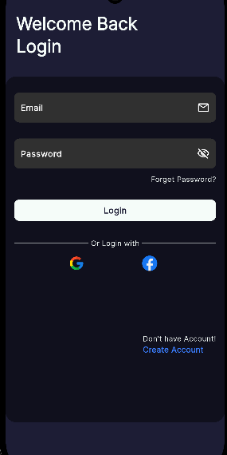
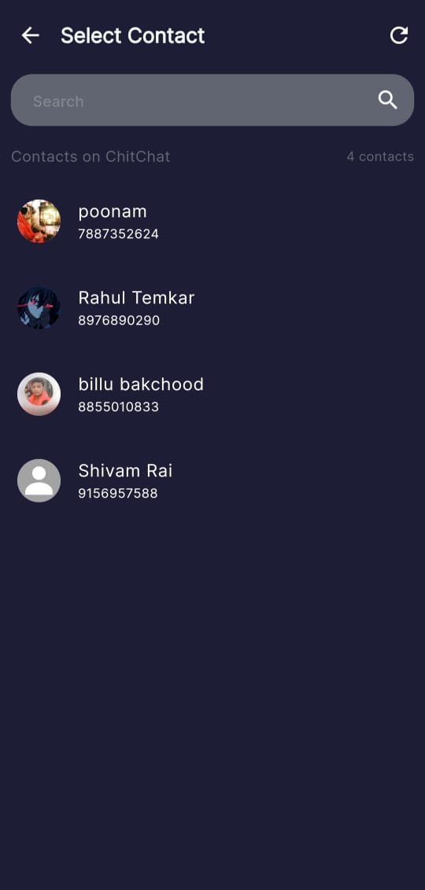
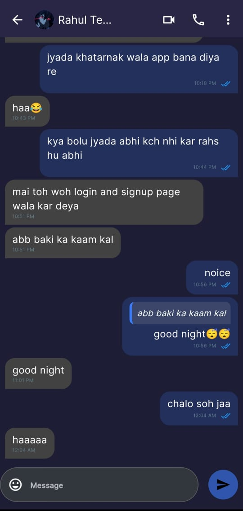

# 💬 ChitChat – AI-Powered Messaging App

ChitChat is a real-time one-to-one messaging app built with Flutter and Firebase. It includes modern features like message editing, deleting, and replying, plus a built-in Gemini AI chatbot for smart conversations. Users can sign in with Google and manage their profiles with cloud-based image storage.

---

## 📱 UI Screenshots

<p float="left">
  
  
  
</p>

---

## 🌟 Features

- 💬 One-to-One Real-Time Messaging
- ✏️ Edit, Delete & Reply to Messages
- 🤖 Gemini AI Chatbot for Smart Replies
- 🔐 Google Sign-In Authentication
- 🖼️ Upload & Store Profile Images via Cloudinary
- 🧾 Modern UI with Clean Form Validations
- 🧠 AI Chat using Gemini API
- 📦 State Management using **Flutter BLoC & Cubit**
- 🔔 Firebase Push Notifications *(optional)*

---

## 🛠️ Tech Stack

**Frontend:** Flutter, Dart  
**Backend:** Firebase Auth, Firebase Realtime Database / Firestore  
**State Management:** Flutter BLoC, Cubit  
**Storage:** Firebase Storage, Cloudinary  
**AI:** Gemini AI API  
**Others:** Firebase CLI, FlutterFire

---

## 🧠 AI Integration

- Integrated **Gemini AI API** as a chatbot to handle smart, contextual replies.
- Designed for a smooth user experience alongside human conversations.

---

## 🚀 Deployment

- **App:** _Not Deployed Yet_  
- **Backend:** Firebase (via Firebase CLI)

---

## 🧪 Installation (For Local Setup)

```bash
# Clone the repository
git clone https://github.com/GAURANG1205/ChitChat.git
cd ChitChat

# Get Flutter packages
flutter pub get

# Run the app
flutter run
